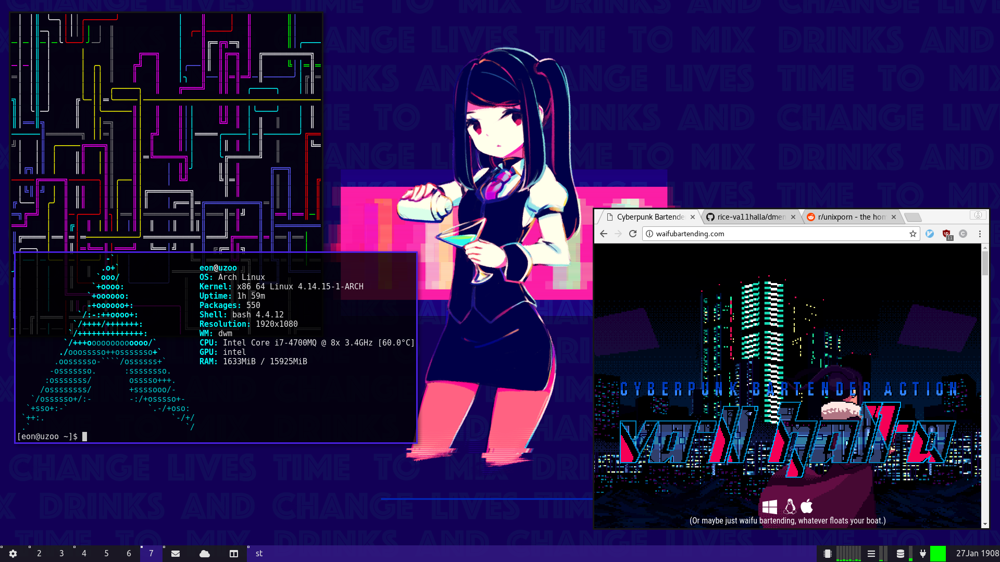

# slstatus

A suckless status monitor for DWM written in pure C without any system() calls.

# Information included

- wifi percentage
- battery percentage
- cpu usage in percent
- cpu temperature
- ram usage in percent
- alsa volume level in percent
- disk usage
- date
- time

Multiple batteries, wifi cards etc. are supported and everything can be reordered and customized via a C header file (similar to DWM).

# Screenshot



# Installation

Just run ```sudo make install```! :P

# Configuration

Just change config.h (commented) to your needs and recompile!

# Starting

Put the following code in your ~/.xinitrc:

```
while true; do
    slstatus
done &
```

# Contributing

See TODO.md for things that you could do.

People who contributed are listed in the CONTRIBUTORS.md file.

If you want to contribute, please use [the suckless coding style](http://suckless.org/coding_style)! For indentation please use 4 spaces.
